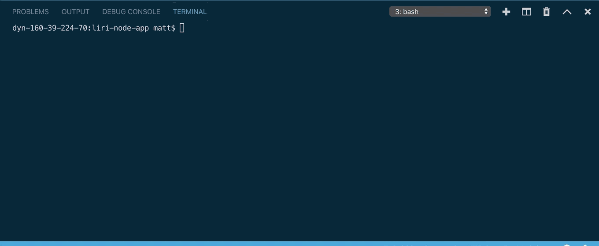
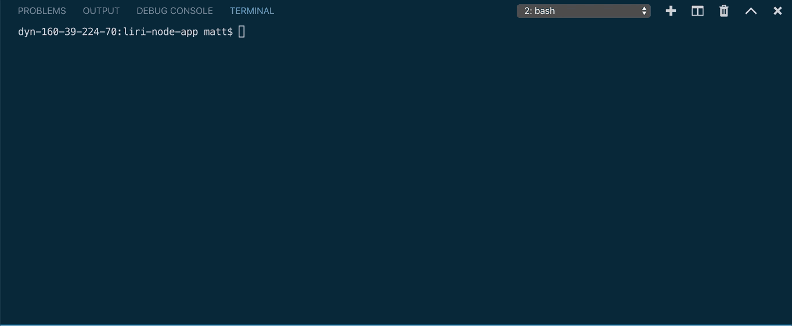

# Liri

Liri is a node based app that uses the NPM packages Axios and Spotify. It also uses the the OMDB API and the BandsInTown API. 

Liri supports the following arguments:

* concert-this <artist-name>

This command will return a list of venues that the given artist is playing at in the upcoming months.

* spotify-this-song 'song-title'

This command returns details and a link to given song

* movie-this 'movie-title'

This command will return the details about a given movie.

* do-what-it-says

This command reads the contents of the random.txt file in the project folder and executes the command that is in that file.

